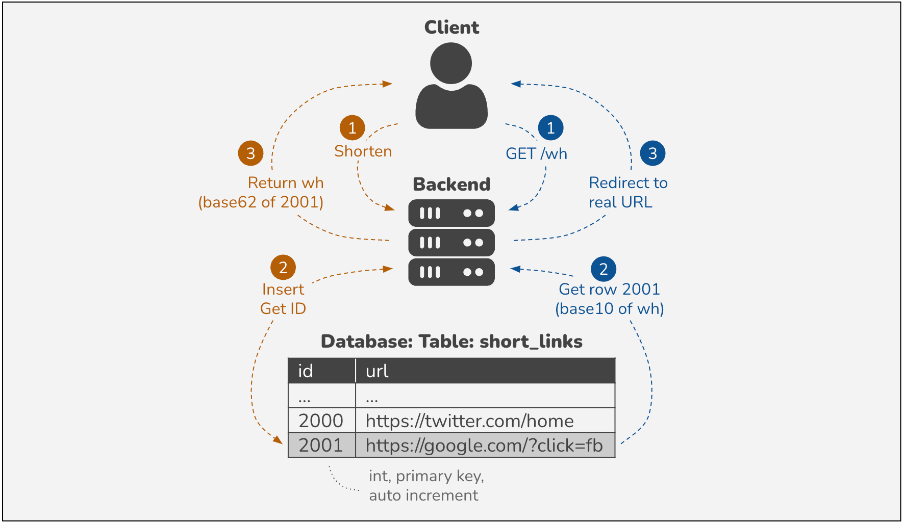

Blog: https://liamhieuvu.com/url-shortener-with-golang-and-mysql

# System design

**Problem**: We want to use a short link, e.g. `company.co/a3w`, instead of a long one, e.g. `company.com/?utm_source=fb&utm_campaign=blog&query=me`.

**Benefit**: Shorter link for a post, brand recognization, traffic tracking.

**Solution**: Insert the long link into database, then use its ID (integer, auto increment) as a short link. When a client gets /id, we return 308 HTTP status with the long link as redirected URL. The ID is base 10, so we can convert it to base 16 (hex) or even base 62 for shorter.

**Pros**: Simple and fast! Compared to hash method (hash of long link as ID) or random ID, we don't need any computation. Moreover, our primary key type is integer, so `insert` and `select` queries are fast.

**Cons**: Difficult to custom a short link like `company.co/liamvu`



# Setup database

```bash
docker pull mariadb:latest
docker run -d -p 3306:3306 --name shortener-mariadb --env MARIADB_ROOT_PASSWORD=root --env MARIADB_DATABASE=dbname --env MARIADB_USER=user --env MARIADB_PASSWORD=pass mariadb:latest
```

# Check results

Run the app

```bash
go run main.go
```

Create a short link:

```bash
$ curl --request POST 'localhost:8080/links' --header 'Content-Type: application/json' --data-raw '{"url": "https://github.com/?click=fb"}'

# result
{"short":"wh"}
```

Access the short link using `curl`:

```bash
$ curl localhost:8080/wh

# result
<a href="https://github.com/?click=fb">Permanent Redirect</a>.
```
